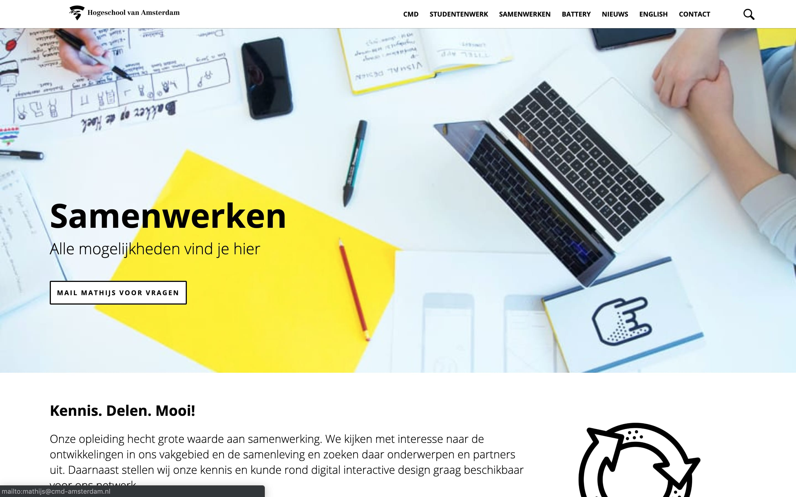
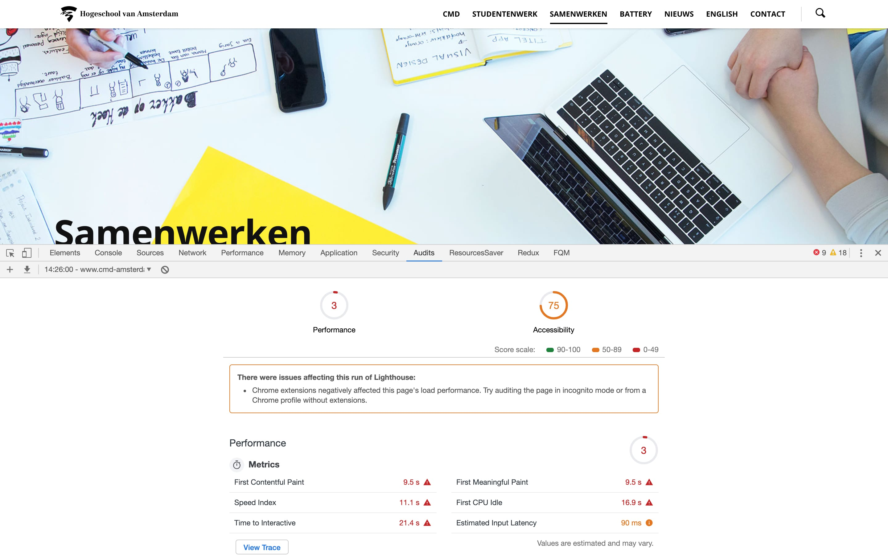
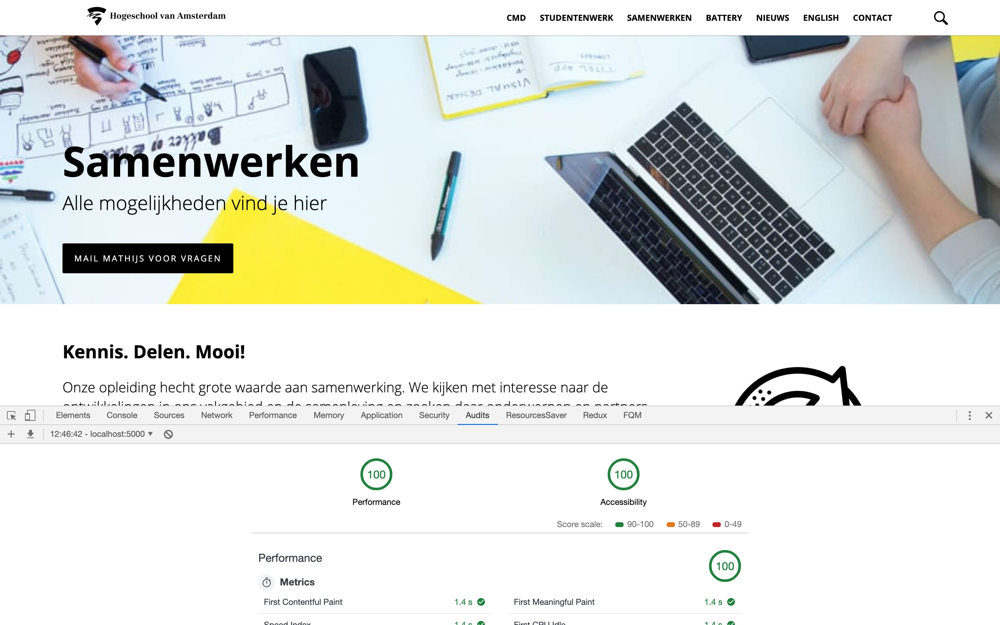

# CMD Amsterdam

## Beschrijving
De samenwerken pagina van de CMD Amsterdam website nagebouwd en daarvan de prestaties en toegankelijkheid verbeterd.

## Huidige problemen
Op de huidige website van CMD Amsterdam, heb ik onderzoek gedaan naar de "prestaties" en de "toegankelijkheid" van de website. Daar zijn een aantal punten uitgekomen die nog matig zijn.

### Prestaties:
- Eerste render van de pagina na 30 seconden op langzaam 3G verbinding
- Teveel scripts worden in geladen door plugins
- Plugins scripts worden bovenin de HTML geladen waardoor dat de render tegenhoud
- Te grote afbeeldingen worden gebruikt
- Alle afbeeldingen van de pagina worden gelijk ingeladen
- Afbeeldingen worden in een te groot formaat opgeslagen
- Er wordt geen tekst compressie gebruikt
- Veel CSS code wordt niet gebruikt
- JavaScript en CSS zijn niet verkleind
- Er wordt geen caching gebruikt voor afbeeldingen / bestanden / pagina's
- Je ziet de tekst pas als de font helemaal gedownload wordt
- Teveel JavaScript wordt tegelijk uitgevoerd
- Teveel data wordt er gedownload bij het openen van een pagina (4.1mb)

### Toegankelijkheid:
- Het kleurcontrast van de links op het gele achtergrond is te laag
- Links hebben niet de juiste waarneembare tekst
- Viewport meta tag wordt niet goed gebruikt

Deze punten die hierboven beschreven worden, zijn de grootste punten die verbeterd kunnen worden. Er zijn ook nog hele kleine puntjes die verbeterd kunnen worden, maar die zijn niet het belangrijskte.

## Waar ben ik mee begonnen?
Ik ben begonnen om te kijken of ik alle website data uit de WordPress Web API kan halen zodat ik die kan daarna kan vormgeven zoals de CMD website eruit ziet.
Alle rendered data op de website staat in 1 lange string met heel veel data erin verwerkt. Ik heb gekeken of ik bepaalde tags weg kan filteren door "regex" te gebruiken. Dit ging niet helemaal zoals ik zou willen, dus ik ben gaan zoeken of er een package was waarmee ik dit kon doen. Uiteindelijk, na veel packages geprobeerd te hebben, heb ik de package genaamd "sanitize-html" gevonden waarmee dit heel gemakklijk kunt instellen.
Het probleem wat je blijft houden, is dat veel tag ver genest zijn met willekeurige class namen. Of als je alle divs eruit filtered, krijg je alle elementen onder elkaar waardoor je geen container hebt om te kunnen vormgeven.

## Hoe ben ik verder gegaan?
Door de korte tijd heb ik besloten om een andere aanpak te gebruiken. Ik heb de "samenwerken" pagina helemaal van nul opnieuw gebouwd met HTML en CSS, waardoor ik daarna wel de prestaties en toegankelijkheid kan verbeteren. Zo kan de verschillen laten zien met de huidige website pagina en de pagina die ik van nul heb opgebouwd.

## Eindresultaat
Na sommige punten van de prestaties en toegankelijkheid doorgevoerd te hebben zijn dit de resultaten geworden.

De volgende punten heb ik toegepast
**Prestaties:**
- Te grote afbeeldingen worden gebruikt
- Alle afbeeldingen van de pagina worden gelijk ingeladen
- Afbeeldingen worden in een te groot formaat opgeslagen
- Er wordt geen tekst compressie gebruikt
- Veel CSS code wordt niet gebruikt
- JavaScript en CSS zijn niet verkleind
- Er wordt geen caching gebruikt voor afbeeldingen / bestanden / pagina's
- Je ziet de tekst pas als de font helemaal gedownload wordt
- Teveel JavaScript wordt tegelijk uitgevoerd

**Toegankelijkheid:**
- Het kleurcontrast van de links op het gele achtergrond is te laag
- Links hebben niet de juiste waarneembare tekst
- Viewport meta tag wordt niet goed gebruikt

Zoals je ziet staat de "performance" en de "accessibility" beide op 100. Dit is alleen nog niet met de data uit WordPress. Maar de punten die toegepast zijn, kunnen ook toegepast worden op de huidige website om dit te verbeteren

## Andere oplossing
### Data uit de API halen
Als ik meer tijd zou hebben, dan zou ik wel de data uit de API kunnen halen en die vervolgens vormgeven zoals de CMD Amsterdam website. Dan kun je de WordPress als CMS blijven gebruiken en de server haalt dan alle data op en maakt dat zo zoals de website eruit ziet.

## Aangeraden
Wat ik persoonlijk zou aanraden voor de CMD Amsterdam website, is dat je de website (front end) los haalt van WordPress (back end). De front en de back end kun je aan elkaar koppelen zodat je nog steeds artikelen kunt toevoegen die vervolgens op de website komen te staan. Op deze manier kun je de prestaties en toegankelijkheid zelf bijhouden en ook heel makkelijk verbeteren.
